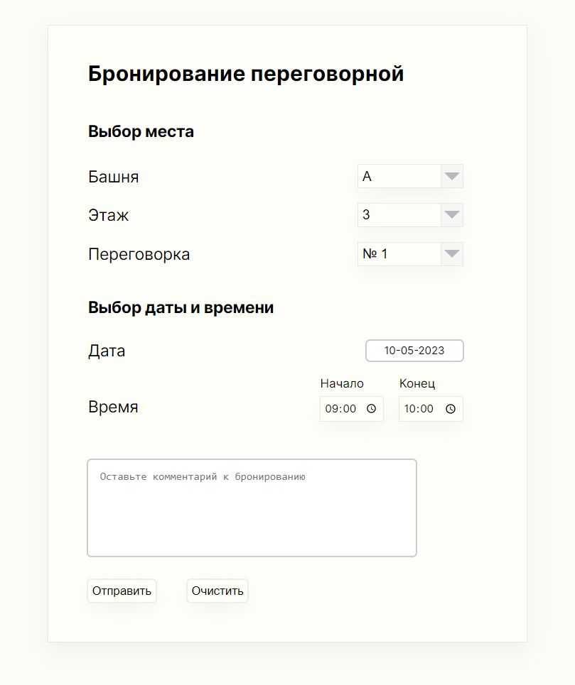

# Проект: VkBookingTest

**Описание**

Проект создается на базе React с использованием Redux.

Проект был выполнен в рамках профильного задания на стажировку в VK. Содержит:

- выпадающий список с выбором башни(А или Б)
- выпадающий список с выбором этажа(с 3 по 27)
- выпадающий список с выбором переговорки(с 1 по 10 на каждом этаже)
- выбор даты с использованием [DatePicker](https://reactdatepicker.com/)
- выбор интервала времени с использованием `<input type="time"/>`
- поле ввода комментария
- кнопка "Отправить"
- кнопка "Очистить"

**Возможности**

Возможности на данный момент:

- Выбор места(башни, этажа и переговорки) в отдельном блоке с помощью выпадающий списков
- Выбор даты с поомощью DatePicker(ввод вручную или выбор даты из календаря) и времени (вручную или из выпадающего списка)
- Ввод комментария
- Очистка формы по клику на кнопку "Очистить", которая устанавливает значения по умолчанию
- Формирование и вывод в консоль в виде JSON собранных значений полей формы
- Валидация полей интервала времени(на соответствие рабочему графику, на корректность границ)
- При наличии ошибки валидации клик по "Отправить" отображает Popup со соответствующим предупреждением и не формирует JSON в консоль
- При отсутствии ошибки валидации клик по "Отправить" отображает Popup с сообщением об успешной отправке данных и формирует JSON в консоль
- Модальное окно (Popup) закрывается при клике на крестик, на ModalOverlay или нажатием на клавишу "Esc"
- С целью избежать лишних ререндеров в проекте используются НОС memo, хук useCallback

**Основные компоненты**

Проект состоит из следующих основных компонентов:

- App - основной компонент, содержащий форму с входящими в нее компонентами и поле комментария
- Place - компонент с выбором башни, этажа, номера переговорки
- DateTime - компонент с выбором даты и интервала времени бронирования
- Modal, ModalOverlay - компоненты, используемые для Popup-a

**Запуск**

Для сборки и запуска проекта необходимо:

- установить [Node.js](https://nodejs.org/en/download) и `npm`
- перейти в директорию проекта
- выполнить в терминале `npm i` и дождаться установки всех зависимостей
- выполнить в терминале `npm start`
- Проект будет доступен по адресу [`http://localhost:3000/`](http://localhost:3000/)
